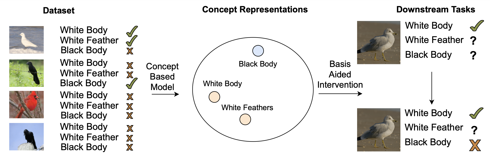

# Concept Hierarchies for Concept Learning Methods



This repository contains the implementation for the thesis "Understanding Inter-Concept Relationships in Concept-Based Models", published at ICML 2024.

This work was done by [Naveen Raman](https://naveenraman.com/), [Mateo Espinosa](https://hairyballtheorem.com/), and [Mateja Jamnik](https://www.cl.cam.ac.uk/~mj201/). 

#### TL;DR
We construct concept bases, a way to study inter relationships in concept models. This allows us to understand the types of inter-concept relationships captured by existing concept-based models. Additionally, well-constructed concept bases can assist with downstream applications such as concept intervention. 

We provide code here to perform the following operations: 
1. Extract concept bases and concept vectors
2. Evaluate concept bases
3. Employ concept bases for concept intervention

We provide the bulk of the code in this repository. However, to run concept interventions, we provide information in the scripts/cem_scripts folder. 

## Installation and Datasets
### Installation
To install dependencies, run the following
```
$ conda env create --file environment.yaml
$ pip install zss
$ pip install tcav 
```

### Datasets
We use four datasets for the project: CUB, CheXpert, DSprites, and colored MNIST:

1. <b>Colored MNIST:</b> We download the Colored MNIST dataset from <a href="https://drive.google.com/u/0/uc?id=1NSv4RCSHjcHois3dXjYw_PaLIoVlLgXu&export=download">here</a>, and use the ```mnist_10color_jitter_var_0.030.npy``` variant.
2. <b>CUB:</b> We download the CUB dataset from <a href="https://www.vision.caltech.edu/datasets/cub_200_2011/">here</a>. 
3. <b>DSprites:</b> We develop DSprites from .npz files in the DSprites directory; to create the dataset, run the following: 
    ```python

    from src.dataset import write_ten_dsprites
    write_ten_dsprites()
    ```
4. <b>CheXpert:</b> We use the small variant of CheXpert from <a href="https://www.kaggle.com/datasets/ashery/chexpert">here</a>

Install each to the dataset/images folder; for examples on what image paths should look like, use the preprocessed/train.py file. 

## Constructing Concept Bases
We give instructions on how to develop each of the following concept vectors: Label,Concept2Vec,TCAV, and detail CEM later
1. <b>Label:</b> To construct label vectors, simply run the following function
    ```python
    from src.concept_vectors import load_label_vectors_simple 
    from src.dataset import CUB_Dataset
    attribute = "has_bill_shape::dagger"
    suffix = ""
    seed = 43
    dataset = CUB_Dataset()
    
    load_label_vectors_simple(attribute,dataset,suffix,seed=seed)
    ```
    where suffix is either "", "_image_robustness", or "_image_responsiveness". Dataset is an object from the Dataset class in `dataset.py`, and attribute is a string representing a concept. 

2. <b>Concept2Vec:</b> We run the following function to create concept2vec vectors:
    ```python
    from src.concept_vectors import load_concept2vec_vectors_simple
    from src.dataset import CUB_Dataset
    from src.create_vectors import create_concept2vec
    
    attribute = "has_bill_shape::dagger"
    suffix = ""
    seed = 43
    dataset = CUB_Dataset()
    create_concept2vec(dataset,suffix,seed=seed,
                                 embedding_size=32,num_epochs=5,dataset_size=1000,initial_embedding=None)    
    load_concept2vec_vectors_simple(attribute,dataset,suffix,seed=seed)
    ```
3. <b>TCAV:</b> We run the following code to create TCAV vectors
    ```python
    from src.concept_vectors import load_tcav_vectors_simple
    from src.dataset import CUB_Dataset
    from src.create_vectors import  create_tcav_dataset
    
    attribute = "has_bill_shape::dagger"
    suffix = ""
    seed = 43
    dataset = CUB_Dataset()
    create_tcav_dataset(attribute,dataset,
                                    10,50,
                                    seed=seed,suffix=suffix)
    load_tcav_vectors_simple(attribute,dataset,suffix,seed=seed)
    ```

    
Once the vectors are created, the created concept basis can be visualized as follows: 
```python
from src.dataset import CUB_Dataset
from src.hierarchy import create_ward_hierarchy, create_hierarchy
from src.concept_vectors import load_shapley_vectors_simple
dataset = CUB_Dataset()
attributes = dataset.get_attributes()

hierarchy = create_hierarchy(create_ward_hierarchy,load_shapley_vectors_simple,dataset,'',attributes,43)
print(hierarchy)
```
Output:
```
          ---- has_upper_tail_color::buff
     ----|
          ---- has_under_tail_color::buff

----|
           ---- has_upperparts_color::buff
      ----|
                ---- has_wing_color::buff
           ----|
                ---- has_back_color::buff
```


## Evaluating Concept Bases
After creating concept vectors, we evaluate them in the `scripts/Evaluate Hierarchies.ipynb`
1. Develop the robustness and responsiveness dataset
    ```python
    from src.dataset import CUB_Dataset
    
    dataset = CUB_Dataset()
    dataset.create_robustness()
    dataset.create_responsiveness()
    ```
2. Train the required vectors, including one additional reference model for faithfulness
    ```python
    from src.concept_vectors import load_concept2vec_vectors_simple
    from src.dataset import CUB_Dataset
    from src.create_vectors import create_concept2vec
    
    for suffix in ["","_image_robustness","_image_responsiveness"]:
        for seed in [43,44,45]:
        create_concept2vec(dataset,suffix,seed=seed,
                                     embedding_size=32,num_epochs=5,dataset_size=1000,initial_embedding=None)    
    create_concept2vec(dataset,"",seed=42,embedding_size=32,num_epochs=5,dataset_size=1000,initial_embedding=None
    ```
3. Evaluate the vectors (code from `scripts/Evaluate Hierarchies.ipynb`
    ```python
    from src.dataset import CUB_Dataset
    from src.metrics import compute_all_metrics
    from src.concept_vectors import load_concept2vec_vectors_simple
    dataset = CUB_Dataset()
    attributes = dataset.get_attributes()
    method = load_concept2vec_vectors_simple
    seeds = [43,44,45]
    
    results = compute_all_metrics(method,
                                        dataset,
                                        attributes,
                                        seeds)
    ```


## Concept Intervention and Training CEM Vectors
We use the Concept Embedding Model (CEM) to test for intervention with concept bases. The CEM model has its own dependencies, and instructions for setting it up is available <a href="https://github.com/mateoespinosa/cem/tree/main">here</a>. We modify certain files to account for concept hierarchy-specific functionality, place those files in `scripts/cem_scripts`, and store a working directory with all those files in the `cem` folder

### Training CEM Vectors
To train CEM vectors, we run the following: 
```bash

$ python experiments/extract_cem_concepts.py --experiment_name $experiment_name --num_gpus $num_gpus --num_epochs 50 --validation_epochs 25 --seed $seed --concept_pair_loss_weight 0
```
In this, `experiment_name` is one of mnist, cub, dsprites, or chexpert, `num_gpus` is the number of GPUs available, and `seed` is the random seed. The resulting vectors are stored at `cem_concepts` folder. 

### Concept Intervention
We perform concept intervention using concept bases in the `scripts/cem_scripts/CEM Intervention Experiments.ipynb` file. This requires a previously trained CEM model; instructions for this are in the <a href="https://github.com/mateoespinosa/cem/tree/main">CEM repository</a>. We additionally provide a pre-trained CEM model, with CUB, which we use for our intervention experiments <a href="https://drive.google.com/file/d/1ILQkLwDw88bYRV7PnTnQZBcwASk0uA0m/view?usp=sharing">here</a> with the config file <a href="https://drive.google.com/file/d/1rJDESQTqIorr_LANijN0QPAUuSl0gd0n/view?usp=sharing">here</a>. To use these, run the following: 
```python
config = joblib.load("models/ConceptEmbeddingModel_resnet34_fold_1_experiment_config.joblib")
if config['weight_loss']:
    imbalance = find_class_imbalance(train_data_path, True)
else:
    imbalance = None
model = intervention_utils.load_trained_model(
            config=config,
            n_tasks=n_tasks,
            n_concepts=n_concepts,
            result_dir="models/",
            split=0,
            imbalance=imbalance,
            intervention_idxs=intervention_idxs,
            train_dl=sample_train_dl,
            sequential=False,
            independent=False,
        )
```

Additionally, this requires concept vectors in the `concept_vectors` folder, which we generate byrunning the following: 
```python
from src.util import save_concept_vectors
from src.dataset import CUB_Dataset
from src.concept_vectors import load_shapley_vectors_simple
save_concept_vectors(load_shapley_vectors_simple,CUB_Dataset(),43,"shapley_43")
```
This saves a file called `results/concept_vectors/shapley_43.npy`, which can be used with the `CEM Intervention Experiments.ipynb` notebook. This notebook details how to perform hierarchical interventions with a variety of hierarchies.  

